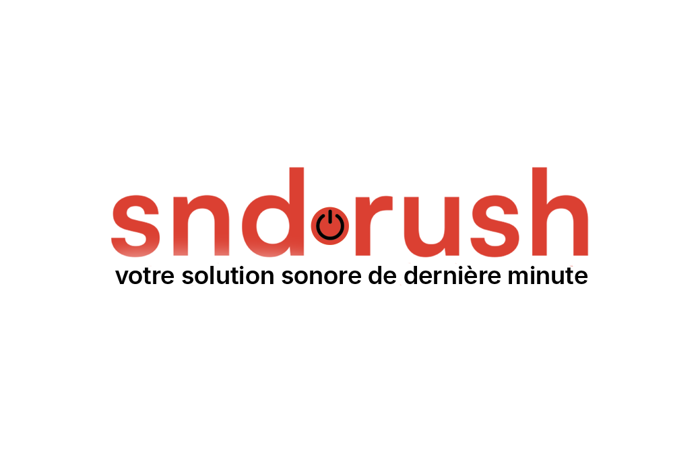
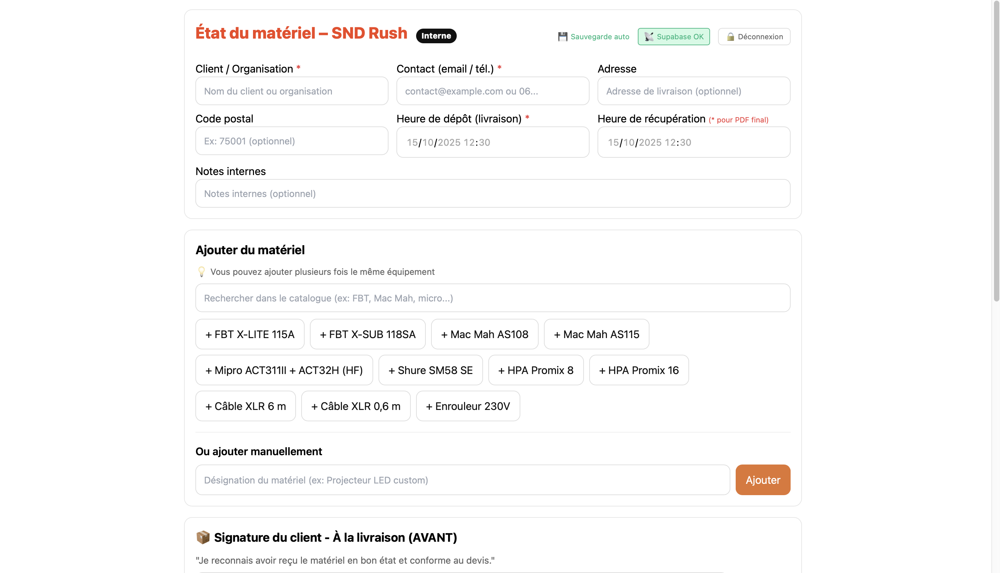
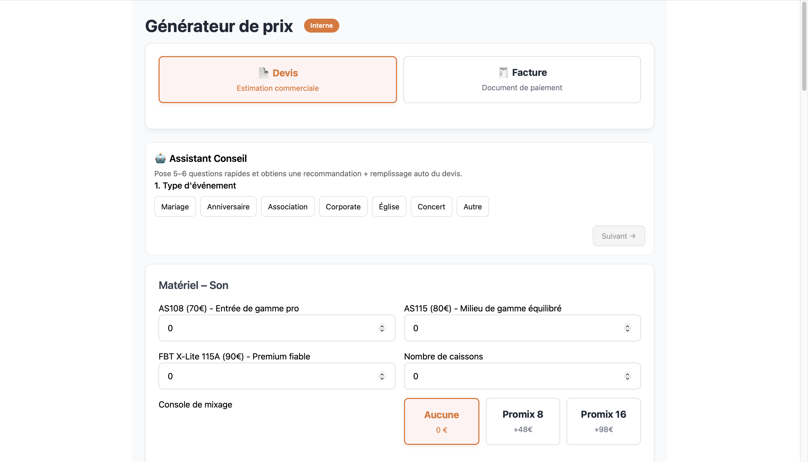

# SND Rush - Location Sono & Lumière Paris

Site web officiel de **SND Rush**, spécialiste de la location de matériel de sonorisation et d'éclairage en urgence 24/7 à Paris et en Île-de-France.

🌐 **Site en production** : [www.sndrush.com](https://www.sndrush.com)

## 🖼️ Aperçu du site

<div align="center">
  
</div>






*Interface moderne et professionnelle avec design sombre, couleurs orange vif et navigation intuitive*

---

## 🎯 À propos

**SND Rush** est le leader français de la location de matériel de sonorisation et d'éclairage en urgence. Depuis notre création, nous nous positionnons comme le partenaire de confiance pour tous vos événements, qu'ils soient professionnels ou privés.

### 🚀 Nos formules
- **Service Express** : Intervention d'urgence 24h/24 - 7j/7 pour vos besoins de dernière minute
- **Réservation à l'avance** : Packs clé en main pour mariages, anniversaires, conférences, concerts et événements corporate

### 🎯 Notre engagement
- ✅ **Matériel professionnel** : Enceintes FBT, caissons de basses, tables de mixage Promix, micros Shure, éclairage LED
- ✅ **Livraison et installation** : Techniciens qualifiés et expérimentés
- ✅ **Support technique 24/7** : Assistance disponible en permanence
- ✅ **Couverture complète** : Paris & Île-de-France, même les weekends et jours fériés
- ✅ **Réponse garantie** : En moins de 5 minutes pour toutes vos demandes
- ✅ **Qualité certifiée** : Matériel testé et certifié avant chaque location

---

## 🚀 Fonctionnalités principales

### 1. **Page d'accueil dynamique**
- Hero section avec carrousel d'images
- Présentation des packs événementiels (Conférence, Mariage, Concert, Soirée, Anniversaire)
- Section FAQ interactive avec recherche intelligente
- Témoignages clients (Trustindex integration)
- Call-to-action optimisés pour la conversion

### 2. **Assistant Conseil IA** (`/generateur_de_prix`)
- Questionnaire guidé en 6 étapes
- Recommandations personnalisées de matériel
- Calcul automatique des prix TTC
- Détection automatique de zone (Paris, Petite Couronne, Grande Couronne)
- Majoration urgence (+20% si événement ≤48h)
- Génération de devis/factures PDF personnalisés
- Système de lignes personnalisées et de caution

### 3. **Système de réservation**
- Sélection de packs prédéfinis
- Personnalisation du matériel (à-la-carte)
- Calcul en temps réel des prix
- Intégration Stripe pour paiement sécurisé
- Confirmation par email automatique
- Support Resend pour l'envoi d'emails

### 4. **État du matériel** (`/etat-materiel`)
- Rapport d'état AVANT/APRÈS location
- Prise de photos horodatées
- Double signature électronique (livraison + reprise)
- Génération de PDF contractuels
- Stockage sécurisé sur Supabase
- Protection par mot de passe (`sndrush2025`)
- Sauvegarde automatique en IndexedDB (anti-perte de données)

### 5. **Conditions Générales de Vente** (`/cgv`)
- CGV complètes et conformes
- Service Express avec conditions spécifiques
- Articles détaillés (caution, annulation, responsabilités, etc.)
- ARTICLE 7 : État des lieux et restitution du matériel
- ARTICLE 8 : Dégradations et facturation des dommages

---

## 🛠️ Stack technique

### Frontend
- **Framework** : [Next.js 15.3.2](https://nextjs.org/) (App Router)
- **Language** : TypeScript
- **Styling** : Tailwind CSS
- **UI Components** : React 19
- **Icons** : Remix Icon
- **PDF Generation** : html2pdf.js

### Backend & Services
- **Database** : Supabase (PostgreSQL)
- **Storage** : Supabase Storage (photos matériel)
- **Email** : Resend
- **Paiement** : Stripe
- **Analytics** : Google Analytics, Vercel Analytics
- **Performance** : Vercel Speed Insights

### Infrastructure
- **Hosting** : Vercel
- **CDN** : Vercel Edge Network
- **Environnement** : Production + Preview + Development

---

## 📦 Installation

### Prérequis
- Node.js 18+ 
- npm ou yarn
- Compte Supabase
- Compte Stripe
- Compte Resend
- Clé API OpenAI (optionnel, pour futures fonctionnalités IA)

### Installation locale

```bash
# Cloner le repository
git clone https://github.com/votre-repo/sndrush.git
cd sndrush

# Installer les dépendances
npm install

# Configurer les variables d'environnement
cp .env.example .env.local
# Éditer .env.local avec vos clés API

# Lancer le serveur de développement
npm run dev
```

Le site sera accessible sur [http://localhost:3000](http://localhost:3000)

### Variables d'environnement requises

```env
# Supabase
NEXT_PUBLIC_SUPABASE_URL=votre_url_supabase
NEXT_PUBLIC_SUPABASE_ANON_KEY=votre_cle_anon

# Stripe
NEXT_PUBLIC_STRIPE_PUBLISHABLE_KEY=pk_...
STRIPE_SECRET_KEY=sk_...

# Resend (Email)
RESEND_API_KEY=re_...

# OpenAI (optionnel)
OPENAI_API_KEY=sk-proj-...

# Base URL
NEXT_PUBLIC_BASE_URL=http://localhost:3000
```

---

## 🗄️ Structure du projet

```
sndrush/
├── app/                          # Pages Next.js (App Router)
│   ├── api/                      # API Routes
│   │   ├── create-stripe-session/
│   │   ├── send-email/
│   │   ├── send-quote/
│   │   ├── sendReservationEmail/
│   │   └── sign-quote/
│   ├── cgv/                      # Conditions Générales de Vente
│   ├── etat-materiel/            # État du matériel AVANT/APRÈS
│   ├── generateur_de_prix/       # Assistant Conseil + Devis
│   ├── reservation/              # Pages de confirmation
│   │   ├── cancel/
│   │   └── success/
│   ├── reserver/                 # Formulaire de réservation
│   └── page.tsx                  # Page d'accueil
├── components/                   # Composants React réutilisables
│   ├── assistant/                # Composants Assistant IA
│   ├── reservation/              # Composants réservation
│   ├── Header.tsx
│   ├── Footer.tsx
│   ├── HeroSection.tsx
│   ├── PacksSection.tsx
│   ├── FAQSection.tsx
│   └── ...
├── hooks/                        # Custom React Hooks
│   ├── useAssistantPersistence.ts
│   ├── usePacks.ts
│   └── useRecommendation.ts
├── lib/                          # Utilitaires et configurations
│   ├── analytics.ts
│   ├── assistant-api.ts
│   ├── assistant-logic.ts
│   ├── inventory.ts
│   ├── packs.ts
│   ├── resend.ts
│   ├── supabase.ts
│   └── zone-detection.ts
├── types/                        # Définitions TypeScript
│   └── assistant.ts
├── public/                       # Assets statiques
│   ├── logo.svg
│   ├── mariage.jpg
│   ├── concert.jpg
│   └── ...
├── supabase-setup.sql           # Schema SQL Supabase
└── README.md
```

---

## 📊 Base de données Supabase

### Tables principales

**`rapports_materiel`** - État du matériel
- `id` : UUID
- `client` : TEXT
- `contact` : TEXT
- `adresse` : TEXT
- `code_postal` : TEXT
- `heure_depot` : TEXT
- `heure_recuperation` : TEXT
- `items` : JSONB (matériel + photos)
- `signature_avant` : TEXT (base64)
- `signature_apres` : TEXT (base64)
- `notes_internes` : TEXT
- `created_at` : TIMESTAMP

### Storage

**`materiel-photos`** - Photos AVANT/APRÈS
- Bucket public
- Format : `etat-materiel/{timestamp}-{random}.jpg`
- Politiques : Upload et lecture publics

---

## 🎨 Barème tarifaire (à-la-carte)

### Matériel (TTC/jour)
- **AS108** (Bluetooth) : 70€
- **AS115** (Milieu de gamme) : 80€
- **FBT X-Lite 115A** (Premium) : 90€
- **Caisson de basse** : 100€
- **Promix 8** : 48€
- **Upgrade Promix 16** : +50€
- **Micro filaire** : 10€
- **Micro sans fil** : 10€

### Services (TTC)
- **Installation** : 80€
- **Technicien** : 50€/heure

### Transport A/R (TTC)
- **Paris** : 80€
- **Petite Couronne** (92, 93, 94) : 120€
- **Grande Couronne** (77, 78, 91, 95) : 156€
- **Retrait sur place** : 0€

### Majoration urgence
- **Événement ≤48h** : +20%

---

## 📝 Scripts disponibles

```bash
# Développement
npm run dev

# Build production
npm run build

# Démarrer en production
npm start

# Linter
npm run lint

# Type checking
npm run type-check
```

---

## 🌍 Déploiement

### Vercel (Recommandé)

1. Connecter le repository GitHub à Vercel
2. Configurer les variables d'environnement dans Vercel Dashboard
3. Déployer automatiquement à chaque push sur `main`

### Variables d'environnement Vercel

Assurez-vous de configurer toutes les variables d'environnement dans :
- **Settings** → **Environment Variables**
- Sélectionner les environnements : Production, Preview, Development

---

## 🔐 Sécurité

- Protection par mot de passe pour `/etat-materiel`
- Validation côté serveur pour tous les formulaires
- Sanitization des données utilisateur
- HTTPS obligatoire en production
- Politiques CORS restrictives
- Clés API en variables d'environnement

---

## 📞 Contact & Support

- **Site web** : [www.sndrush.com](https://www.sndrush.com)
- **Email** : contact@guylocationevents.com

### Réseaux sociaux
- **Instagram** : [@snd_rush](https://www.instagram.com/snd_rush)
- **TikTok** : [@snd.rush](https://www.tiktok.com/@snd.rush)

---

## 📄 Licence

© 2025 SND Rush. Tous droits réservés.

---

## 🚀 Roadmap

- [ ] Intégration ChatGPT pour assistant conversationnel
- [ ] Système de notifications SMS
- [ ] Application mobile (React Native)
- [ ] Dashboard client avec historique de réservations
- [ ] Système de fidélité et points
- [ ] Géolocalisation en temps réel du technicien
- [ ] Paiement en plusieurs fois
- [ ] Marketplace partenaires (DJ, photographes, traiteurs)

---

**Développé avec ❤️ par l'équipe SND Rush**
